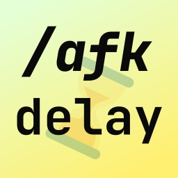

<!-- MR-SKIP-START -->

<!-- MR-SKIP-END -->

# AEssentialsXAFKDelay

> Adds a configurable delay before activating the AFK status.

## What is this?

When you use Essentials AFK feature with `freeze-afk-players`, then you are
probably aware that it gives players essentially a god mode. This allows players
to abuse this feature to escape from fights with mobs or other players, as well
as cancel things like fall damage with one command.

This is why this plugin was born. It adds a configurable delay that player must
wait while standing still and not receiving any damage. If they do, the
activation will be cancelled. It encourages players to seek safety before
activating the status, which is what you expect people stepping _away from
keyboard_ would do.

## Usage

Install it alongside the EssentialsX plugin. Once loaded for the first time it
will create a config folder with `config.yml` file where you can configure the
delay, check activation and change the messages for various languages.

## Why not contribute this to EssentialsX?

I found that writing this ‘addon’ plugin was easier, and it achieved the desired
effect immediately. If I made these changes to EssentialsX I would have to wait
a long time for a review and merge, and in a meanwhile would have to resort to
self-building.

Nevertheless, I will consider remaking this as a patch to Essentials in the
future.

## Configuration options

All configuration options are documented in the config file.

## Feedback and bug reports

All feedback and bug reports are welcome in the [GitHub issues][issues].

[issues]: https://github.com/Brawaru/AEssentialsXAFKDelay/issues

## Support policy

To cut cost of maintenance only the latest major Minecraft versions are
supported (targeted and tested). You may be able to download older versions of
the plugin through releases history, but do not expect any of the changes from
newer versions to be back-ported.

You are welcome to fork and back-port this plugin to work on older versions;
however, no bug reports will be accepted from such builds unless they are
reproducible in newer builds.

## Credits

- Icon uses [JetBrains Mono][jb_mono] font for text and [Twemoji][twemoji] for
  Hourglass symbol.
- This project would not exist without the support of [Fundy's][fundy] offline
  chat community.

[jb_mono]: https://www.jetbrains.com/lp/mono/
[twemoji]: https://twemoji.twitter.com/
[fundy]: https://www.twitch.tv/fundy